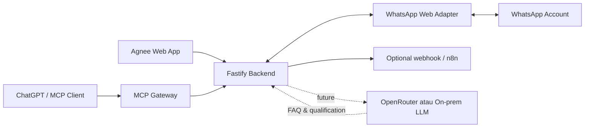

# Agnee Customer Conversation Platform

## Ringkasan

Agnee adalah workspace internal untuk menangani percakapan pelanggan dari
WhatsApp, menjawab FAQ, mengkualifikasi lead, dan meneruskan prospek ke sales.
Versi sekarang adalah MVP single-workspace yang menggunakan koneksi WhatsApp
Web unofficial.

Produk akhirnya direncanakan memakai tiga hostname:

| Hostname | Fungsi |
| --- | --- |
| `agnee.agnive.co` | Landing page dan halaman penjualan produk |
| `app.agnee.agnive.co` | UI internal customer desk |
| `mcp.agnee.agnive.co` | Endpoint MCP untuk ChatGPT atau MCP client lain |

## Gambaran arsitektur



Hubungan komponennya:

- **Web app** adalah frontend untuk customer service dan sales.
- **Backend** adalah pusat autentikasi, aturan bisnis, pengiriman pesan, event
  realtime, dan integrasi eksternal.
- **WhatsApp adapter** hanya menjembatani backend dengan sesi WhatsApp Web.
- **MCP** mengekspos kemampuan backend sebagai tools. MCP tidak otomatis
  memiliki LLM.
- **LLM** bersifat opsional dan nantinya dipanggil backend untuk FAQ,
  klasifikasi intent, rangkuman, serta saran jawaban.
- **n8n** juga opsional. Ia cocok untuk workflow lintas aplikasi, bukan syarat
  agar inbox atau MCP bekerja.

## Alur pesan

### Pesan masuk

1. Pelanggan mengirim pesan WhatsApp.
2. Adapter menerima event dari WhatsApp Web.
3. Backend meneruskan event realtime ke UI melalui SSE.
4. Jika webhook diaktifkan, backend juga dapat mengirim event ke n8n atau
   service internal.
5. Pada fase AI berikutnya, backend mengambil FAQ/context, memanggil LLM, lalu
   memilih antara auto-reply atau handoff ke manusia.

### Pesan keluar

1. Agent mengetik di composer.
2. UI membuat `clientRequestId` unik.
3. Backend mengirim pesan ke WhatsApp dan menyimpan receipt sementara.
4. Request ulang dengan ID yang sama mengembalikan receipt yang sama sehingga
   tidak mengirim pesan ganda.
5. Acknowledgement WhatsApp diperbarui realtime di UI.

### MCP

MCP gateway menyediakan empat tools:

- `whatsapp_status`
- `list_conversations`
- `read_conversation`
- `send_whatsapp_message`

Contoh: ChatGPT memilih tool `read_conversation`; MCP menerjemahkannya menjadi
request API ke backend; backend membaca data WhatsApp; hasil kembali ke ChatGPT.
LLM berada di sisi ChatGPT, bukan di dalam MCP gateway.

## Fitur yang sudah tersedia

- Login dengan signed HttpOnly session cookie.
- Pairing QR dan persistent WhatsApp session.
- Inbox real, pencarian server-side, unread filter, dan pagination.
- Riwayat lazy-loaded, text, foto, stiker, quoted reply, sender group, call log,
  serta delivery acknowledgement.
- Reply via double-click pada baris pesan dan pengiriman lampiran gambar, video,
  audio, atau PDF hingga 6 MB.
- Sinkronisasi pinned chat beserta urutan dan ikon pin pada inbox.
- Pinned-message banner yang membaca pin langsung dari WhatsApp, membuka daftar
  pinned, lalu menavigasi dan menyorot pesan asli dalam riwayat.
- Realtime update melalui Server-Sent Events.
- Safe send dengan draft preservation, reconciliation, dan idempotency.
- Responsive desktop/mobile layout serta lead context drawer.
- Contacts dan Funnel workspace, percakapan baru, menu aksi chat, serta handoff
  lead in-memory untuk alur MVP.
- API key untuk integrasi internal.
- MCP melalui Streamable HTTP dan stdio.
- Demo mode tanpa mengirim pesan WhatsApp real.
- Docker Compose dan helper script untuk server.

## Yang belum tersedia

- Database tenant, user, lead, funnel, dan assignment.
- Knowledge base FAQ dan vector search.
- Auto-reply atau copilot berbasis LLM.
- Qualified filter yang tersambung ke data lead nyata.
- Full inline renderer video/audio/document.
- Persistence database untuk Contacts, Funnel, dan assignment.
- Database role-based access dan audit trail multi-tenant.
- OAuth client registration sudah persisten, tetapi refresh grants masih
  in-memory; restart MCP dapat meminta user ChatGPT melakukan login ulang.
- Adapter resmi WhatsApp Business Platform.

## Struktur repository

```text
.
├── assets/brand/          Logo dan aset brand Agnee
├── public/                Frontend HTML, CSS, dan browser JavaScript
├── scripts/               Helper server dan MCP smoke test
├── src/
│   ├── server.js          App/API, auth, SSE, dan WhatsApp adapter
│   ├── mcp-server.mjs     Definisi MCP tools
│   ├── mcp-http.mjs       Streamable HTTP MCP endpoint
│   └── mcp-stdio.mjs      Local stdio MCP transport
├── test/                  Node test suite
├── compose.yml            App dan MCP services
├── Dockerfile
├── README.md              Quick start dan command reference
└── CHANGELOG.md           Riwayat perubahan
```

## Menjalankan secara lokal

### Persyaratan

- Node.js 22 atau lebih baru.
- Google Chrome/Chromium untuk adapter WhatsApp.
- Nomor WhatsApp test yang memang diizinkan untuk prototype.

### Demo aman

```bash
npm install
WA_STARTUP_ENABLED=false WA_DEMO_MODE=true npm start
```

Buka <http://127.0.0.1:4100>. Demo mode tidak mengirim pesan WhatsApp real.

### WhatsApp real

```bash
cp .env.example .env
# Isi semua secret dan credential di .env
npm start
```

Buka UI, login, klik connection status, lalu scan QR melalui WhatsApp → Linked
Devices. Jangan commit `.env` atau direktori session WhatsApp.

## Service dan port

| Service | Default | Keterangan |
| --- | --- | --- |
| App/API | `127.0.0.1:4100` | UI, API, SSE, dan WhatsApp adapter |
| MCP HTTP | `127.0.0.1:4200/mcp` | Endpoint untuk remote MCP client |

Di server, kedua port tetap loopback-only. Reverse proxy menangani TLS dan
hostname publik.

## API utama

```text
POST /v1/auth/login
POST /v1/auth/logout
GET  /v1/auth/session
GET  /v1/whatsapp/status
GET  /v1/whatsapp/qr
GET  /v1/events
GET  /v1/chats?limit=12&offset=0&q=&filter=all
GET  /v1/chats/:chatId/messages?limit=30
GET  /v1/chats/:chatId/pinned
GET  /v1/chats/:chatId/lead
POST /v1/chats/:chatId/assign
GET  /v1/chats/:chatId/avatar
GET  /v1/messages/:messageId/media
POST /v1/messages/send
```

Browser memakai session cookie. Integrasi internal memakai header
`x-api-key`. MCP publik memakai OAuth 2.1 + PKCE; bearer token terpisah hanya
untuk Inspector dan smoke test internal.

## Testing

```bash
npm run check
npm test
npm run test:mcp
```

`test:mcp` memerlukan app dan MCP HTTP yang sedang berjalan.

## Deployment server

```bash
chmod +x scripts/server.sh
./scripts/server.sh check
./scripts/server.sh init
./scripts/server.sh up
./scripts/server.sh status
```

Reverse proxy yang direkomendasikan:

```text
app.agnee.agnive.co  -> 127.0.0.1:4100
mcp.agnee.agnive.co  -> 127.0.0.1:4200
```

Landing page `agnee.agnive.co` adalah deployment terpisah dari internal app.
Selama landing page belum tersedia, Nginx mengalihkan hostname tersebut ke app.

Deployment Radmond dapat dijalankan dari Mac dengan:

```bash
./scripts/deploy-radmond.sh
```

Script melakukan sync tanpa `.env`/session, membuat secret sekali pada server,
menjalankan Compose, memasang exact Nginx virtual hosts, dan menerbitkan
sertifikat TLS untuk ketiga hostname.

## Strategi AI yang hemat

Untuk FAQ dan funneling, hindari mengirim seluruh histori ke LLM setiap pesan.
Pipeline yang disarankan:

1. Rules murah untuk greeting, spam, jam operasional, dan command sederhana.
2. Retrieval hanya mengambil beberapa FAQ yang relevan.
3. Kirim ringkasan percakapan + pesan terbaru + FAQ terpilih ke model kecil.
4. Gunakan model lebih kuat hanya untuk kasus ambigu atau high-value lead.
5. Simpan summary, intent, stage, dan confidence agar tidak dihitung ulang.
6. Handoff ke manusia ketika confidence rendah atau pelanggan meminta sales.

OpenRouter cocok untuk MVP karena tidak perlu mengelola GPU. Model on-prem dapat
ditambahkan saat volume stabil dan biaya GPU lebih rendah daripada pemakaian
API. Keduanya berada di belakang backend yang sama sehingga UI dan MCP tidak
perlu berubah.

## Risiko dan keamanan

- Adapter saat ini unofficial; jangan dipakai untuk bulk messaging atau nomor
  bisnis utama tanpa menerima risiko logout/restriction.
- Gunakan credential panjang dan berbeda untuk `API_KEY`, `SESSION_SECRET`,
  `MCP_BEARER_TOKEN`, dan `MCP_OAUTH_SIGNING_SECRET`.
- Jangan expose port 4100/4200 langsung; gunakan TLS reverse proxy.
- Batasi MCP send tool sebelum diberikan kepada client eksternal.
- Untuk production multi-tenant, tambahkan database, queue, RBAC, audit log,
  rate limiting, secret manager, backup, monitoring, dan adapter WhatsApp resmi.

## Roadmap yang disarankan

1. PostgreSQL untuk workspace, contacts, leads, funnel, assignments, dan audit.
2. FAQ knowledge base + retrieval + reply suggestion.
3. Human approval mode sebelum auto-reply.
4. Sales handoff, SLA, notification, dan analytics.
5. Multi-tenant auth/RBAC, persistent OAuth grants, dan audit log MCP.
6. Migrasi channel production ke WhatsApp Business Platform.
