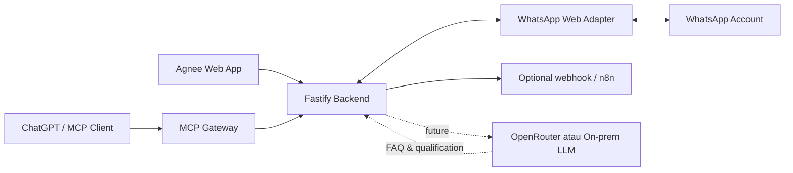

# Agnee Customer Conversation Platform

## Ringkasan

Agnee adalah workspace internal untuk menangani percakapan pelanggan dari
WhatsApp, menjawab FAQ, mengkualifikasi lead, dan meneruskan prospek ke sales.
Versi sekarang adalah MVP single-workspace yang menggunakan koneksi WhatsApp
Web unofficial.

Produk akhirnya direncanakan memakai tiga hostname:

| Hostname | Fungsi |
| --- | --- |
| `agnee.agnive.co` | Landing page dan halaman penjualan produk |
| `app.agnee.agnive.co` | UI internal customer desk |
| `mcp.agnee.agnive.co` | Endpoint MCP untuk ChatGPT atau MCP client lain |

## Gambaran arsitektur


```mermaid
flowchart LR
    UI[Agnee Web App] --> API[Fastify Backend]
    MCP[ChatGPT / MCP Client] --> MCPGW[MCP Gateway]
    MCPGW --> API
    API <--> WA[WhatsApp Web Adapter]
    WA <--> PHONE[WhatsApp Account]
    API --> HOOK[Optional webhook / n8n]
    API -. future .-> LLM[OpenRouter atau On-prem LLM]
    LLM -. FAQ & qualification .-> API
```

Hubungan komponennya:

- **Web app** adalah frontend untuk customer service dan sales.
- **Backend** adalah pusat autentikasi, aturan bisnis, pengiriman pesan, event
  realtime, dan integrasi eksternal.
- **WhatsApp adapter** hanya menjembatani backend dengan sesi WhatsApp Web.
- **MCP** mengekspos kemampuan backend sebagai tools. MCP tidak otomatis
  memiliki LLM.
- **LLM** bersifat opsional dan nantinya dipanggil backend untuk FAQ,
  klasifikasi intent, rangkuman, serta saran jawaban.
- **n8n** juga opsional. Ia cocok untuk workflow lintas aplikasi, bukan syarat
  agar inbox atau MCP bekerja.

## Alur pesan

### Pesan masuk

1. Pelanggan mengirim pesan WhatsApp.
2. Adapter menerima event dari WhatsApp Web.
3. Backend meneruskan event realtime ke UI melalui SSE.
4. Jika webhook diaktifkan, backend juga dapat mengirim event ke n8n atau
   service internal.
5. Pada fase AI berikutnya, backend mengambil FAQ/context, memanggil LLM, lalu
   memilih antara auto-reply atau handoff ke manusia.

### Pesan keluar

1. Agent mengetik di composer.
2. UI membuat `clientRequestId` unik.
3. Backend mengirim pesan ke WhatsApp dan menyimpan receipt sementara.
4. Request ulang dengan ID yang sama mengembalikan receipt yang sama sehingga
   tidak mengirim pesan ganda.
5. Acknowledgement WhatsApp diperbarui realtime di UI.

### MCP

MCP gateway menyediakan empat tools:

- `whatsapp_status`
- `list_conversations`
- `read_conversation`
- `send_whatsapp_message`

Contoh: ChatGPT memilih tool `read_conversation`; MCP menerjemahkannya menjadi
request API ke backend; backend membaca data WhatsApp; hasil kembali ke ChatGPT.
LLM berada di sisi ChatGPT, bukan di dalam MCP gateway.

## Fitur yang sudah tersedia

Status per 8 Oktober 2026. Daftar di bawah blok ini adalah fitur inti MVP awal
dan masih berlaku; blok ini mencatat yang ditambahkan sesudahnya. Detail per
perubahan ada di [`CHANGELOG.md`](CHANGELOG.md).

- PostgreSQL multi-tenant (migrasi `db/migrations/001` sampai `049`), login
  per user dengan peran, dan isolasi data antar company. Produksi menolak
  start tanpa database.
- Frontend React (`web/`, Vite) di `/app/`, konsol platform `/superhuman`, dan
  halaman hukum `/privasi` dan `/ketentuan`.
- Alert biaya AI per company (ambang per paket) lewat lencana `/superhuman`,
  email, dan WhatsApp; kanal diatur di `.env` (`COST_ALERT_*`).
- Balasan otomatis AI via OpenRouter dengan rantai model per company, kontrak
  keluaran (klaim hasil, placeholder, link), jeda balasan 5 sampai 60 detik
  dengan indikator mengetik, follow-up, dan batas paket.
- Coach: fakta terkonfirmasi, wawancara, skenario, simulasi, dan penilaian
  balasan. Playbook delapan jenis dengan dukungan per produk, dan setelan
  identitas AI (anggota tim atau chatbot) per company.
- Knowledge Source (KS): paket template percakapan yang dipasang ke company,
  dengan simulasi sebagai gerbang aktivasi. Lihat
  [`docs/knowledge-source.md`](docs/knowledge-source.md).
- Broadcast ke customer yang pernah chat, dengan tempo, jam, dan batas harian,
  bisa dipilih per kelompok (tahap lead, hari, produk, hubungan, label
  WhatsApp). Daftar penerima memakai `inbound_messages`, `lead_states`,
  `conversation_routing`, dan kontak hasil impor.
- Impor chat dari WhatsApp ke Lead List (supervisor): membaca daftar chat nomor
  yang tersambung, tanpa isi pesan, lalu mengelompokkan menurut hubungan,
  keaktifan, label WhatsApp Business, dan produk. Live 8 Oktober, belum pernah
  dicoba di WhatsApp sungguhan.
- Tugas dengan SLA jam kerja, jejak audit, rotasi nomor WhatsApp, dan integrasi
  lead Mayar.
- Jalur kedua WhatsApp Business Platform (Cloud API) tersedia di kode; produksi
  memakai `whatsapp-web.js`.

Fitur inti MVP awal:

- Login dengan signed HttpOnly session cookie.
- Pairing QR dan persistent WhatsApp session.
- Inbox real, pencarian server-side, unread filter, dan pagination.
- Riwayat lazy-loaded, text, foto, stiker, quoted reply, sender group, call log,
  serta delivery acknowledgement.
- Reply via double-click pada baris pesan dan pengiriman lampiran gambar, video,
  audio, atau PDF hingga 6 MB.
- Sinkronisasi pinned chat beserta urutan dan ikon pin pada inbox.
- Pinned-message banner yang membaca pin langsung dari WhatsApp, membuka daftar
  pinned, lalu menavigasi dan menyorot pesan asli dalam riwayat.
- Realtime update melalui Server-Sent Events.
- Safe send dengan draft preservation, reconciliation, dan idempotency.
- Responsive desktop/mobile layout serta lead context drawer.
- Contacts dan Funnel workspace, percakapan baru, menu aksi chat, serta handoff
  lead in-memory untuk alur MVP.
- API key untuk integrasi internal.
- MCP melalui Streamable HTTP dan stdio.
- Demo mode tanpa mengirim pesan WhatsApp real.
- Docker Compose dan helper script untuk server.

## Yang belum tersedia

Status per 8 Oktober 2026. Database, auto-reply LLM, RBAC, dan audit trail yang
dulu ada di daftar ini sudah tersedia (lihat blok status di atas).

- Backend Expertz (katalog paket Knowledge Source lewat API/MCP).
- Vector search untuk knowledge base; pencarian FAQ sekarang berbasis skor
  kata kunci.
- Deteksi permintaan berhenti dihubungi untuk follow-up.
- Entri jejak audit untuk impor chat (memotong kuota AI dan membuka kontak ke
  broadcast, tetapi akibatnya tidak keluar dari Agnee), dan impor CSV nomor
  dingin untuk broadcast (sengaja tidak didukung: risiko nomor QR diblokir).
- Balasan untuk foto yang dikirim tanpa teks.
- Antrean balasan yang tahan restart server (jeda balasan hidup di memori).
- Full inline renderer video/audio/document.
- OAuth client registration sudah persisten, tetapi refresh grants masih
  in-memory; restart MCP dapat meminta user ChatGPT melakukan login ulang.
- Adapter resmi WhatsApp Business Platform.

## Struktur repository

```text
.
├── assets/brand/          Logo dan aset brand Agnee
├── web/                   Frontend React + Tailwind (sumber; dibangun ke dist/)
├── public/                Aset statis yang disajikan apa adanya (gambar landing)
├── docs/                  Setup, operations, dan work history
├── knowledge/             FAQ, funnel, dan reply policy untuk retrieval
├── scripts/               Helper server dan MCP smoke test
├── src/
│   ├── server.js          App/API, auth, SSE, dan WhatsApp adapter
│   ├── mcp-server.mjs     Definisi MCP tools
│   ├── mcp-http.mjs       Streamable HTTP MCP endpoint
│   └── mcp-stdio.mjs      Local stdio MCP transport
├── test/                  Node test suite
├── compose.yml            App dan MCP services
├── Dockerfile
├── README.md              Quick start dan command reference
└── CHANGELOG.md           Riwayat perubahan
```

## Menjalankan secara lokal

### Persyaratan

- Node.js 22 atau lebih baru.
- Google Chrome/Chromium untuk adapter WhatsApp.
- Nomor WhatsApp test yang memang diizinkan untuk prototype.

### Demo aman

```bash
npm install
WA_STARTUP_ENABLED=false WA_DEMO_MODE=true npm start
```

Buka <http://127.0.0.1:4100>. Demo mode tidak mengirim pesan WhatsApp real.

### WhatsApp real

```bash
cp .env.example .env
# Isi semua secret dan credential di .env
npm start
```

Buka UI, login, klik connection status, lalu scan QR melalui WhatsApp → Linked
Devices. Jangan commit `.env` atau direktori session WhatsApp.

## Service dan port

| Service | Default | Keterangan |
| --- | --- | --- |
| App/API | `127.0.0.1:4100` | UI, API, SSE, dan WhatsApp adapter |
| MCP HTTP | `127.0.0.1:4200/mcp` | Endpoint untuk remote MCP client |

Di server, kedua port tetap loopback-only. Reverse proxy menangani TLS dan
hostname publik.

## API utama

```text
POST /v1/auth/login
POST /v1/auth/logout
GET  /v1/auth/session
GET  /v1/whatsapp/status
GET  /v1/whatsapp/qr
GET  /v1/events
GET  /v1/chats?limit=12&offset=0&q=&filter=all
GET  /v1/chats/:chatId/messages?limit=30
GET  /v1/chats/:chatId/pinned
GET  /v1/chats/:chatId/lead
POST /v1/chats/:chatId/routing
GET  /v1/chats/:chatId/avatar
GET  /v1/messages/:messageId/media
POST /v1/messages/send
GET  /v1/ks/catalog
GET  /v1/ks/installs
POST /v1/ks/installs
PUT  /v1/ks/installs/:id/specific
POST /v1/ks/installs/:id/simulate
POST /v1/ks/installs/:id/activate
GET  /v1/broadcasts
GET  /v1/broadcasts/audience
POST /v1/broadcasts
GET  /v1/broadcasts/:id
GET  /v1/contacts/import
POST /v1/contacts/import
DELETE /v1/contacts/import
```

Daftar ini hanya rute inti dan KS; seluruh rute ada di `src/server.js`.

Browser memakai session cookie. Integrasi internal memakai header
`x-api-key`. MCP publik memakai OAuth 2.1 + PKCE; bearer token terpisah hanya
untuk Inspector dan smoke test internal.

## Frontend

Sumbernya di `web/` (React + Tailwind, dibangun Vite). Server **tidak** bisa
melayani satu halaman pun sebelum build-nya ada — kalau `dist/` kosong, setiap
halaman menjawab 503 beserta instruksinya.

```bash
npm run build:web   # bangun sekali ke dist/
npm run dev:web     # dev server Vite di :5173, API diproxy ke :4100
```

Bundelnya disajikan di bawah `/app/`, bukan `/assets/` — `public/assets/` sudah
dipakai gambar landing dan akan tertutup kalau keduanya berbagi prefix.

## Testing

```bash
npm run check
npm test
npm run test:mcp
```

`check` ikut menjalankan `tsc --noEmit`. `test:mcp` memerlukan app dan MCP HTTP
yang sedang berjalan.

## Deployment server

```bash
chmod +x scripts/server.sh
./scripts/server.sh check
./scripts/server.sh init
./scripts/server.sh up
./scripts/server.sh status
```

Reverse proxy yang direkomendasikan:

```text
app.agnee.agnive.co  -> 127.0.0.1:4100
mcp.agnee.agnive.co  -> 127.0.0.1:4200
```

Jalur deploy yang sebenarnya adalah `git push origin main`, yang memicu GitHub
Actions "Test & Deploy to Production" (test lalu SSH ke server, `git pull`,
`deploy/remote-deploy.sh`). Deploy mengantre lewat concurrency group
`deploy-production`, dan `remote-deploy.sh` menunggu build lain di server
(misalnya Insight) lalu batal sebelum build kalau sisa disk di bawah 2 GB.
Jangan push ke remote `deploy` (legacy). Di server,
`COMPOSE_FILE=compose.yml:/root/agnee-net-override.yml` menaruh stack di jaringan
eksternal `agnee_net3`. Commit yang sedang jalan di server dibaca dari
`docker exec agnee-app-1 cat /app/.git-sha`; lihat `docs/SETUP.md` bagian Deploy
macet untuk penyebab yang sudah terjadi.

Landing page `agnee.agnive.co` adalah deployment terpisah dari internal app.
Selama landing page belum tersedia, Nginx mengalihkan hostname tersebut ke app.

Deployment Radmond dapat dijalankan dari Mac dengan:

```bash
./scripts/deploy-radmond.sh
```

Script melakukan sync tanpa `.env`/session, membuat secret sekali pada server,
menjalankan Compose, memasang exact Nginx virtual hosts, dan menerbitkan
sertifikat TLS untuk ketiga hostname.

## Strategi AI yang hemat

Untuk FAQ dan funneling, hindari mengirim seluruh histori ke LLM setiap pesan.
Pipeline yang disarankan:

1. Rules murah untuk greeting, spam, jam operasional, dan command sederhana.
2. Retrieval hanya mengambil beberapa FAQ yang relevan.
3. Kirim ringkasan percakapan + pesan terbaru + FAQ terpilih ke model kecil.
4. Gunakan model lebih kuat hanya untuk kasus ambigu atau high-value lead.
5. Simpan summary, intent, stage, dan confidence agar tidak dihitung ulang.
6. Handoff ke manusia ketika confidence rendah atau pelanggan meminta sales.

OpenRouter cocok untuk MVP karena tidak perlu mengelola GPU. Model on-prem dapat
ditambahkan saat volume stabil dan biaya GPU lebih rendah daripada pemakaian
API. Keduanya berada di belakang backend yang sama sehingga UI dan MCP tidak
perlu berubah.

## Risiko dan keamanan

- Adapter saat ini unofficial; jangan dipakai untuk bulk messaging atau nomor
  bisnis utama tanpa menerima risiko logout/restriction.
- Gunakan credential panjang dan berbeda untuk `API_KEY`, `SESSION_SECRET`,
  `MCP_BEARER_TOKEN`, dan `MCP_OAUTH_SIGNING_SECRET`.
- Jangan expose port 4100/4200 langsung; gunakan TLS reverse proxy.
- Batasi MCP send tool sebelum diberikan kepada client eksternal.
- Nama model AI, vendor, dan harga per token adalah rahasia bisnis: pelanggan
  hanya melihat tingkatan ("High-end AI model"). Klien dan API bertukar kunci
  tingkatan; id OpenRouter asli hanya ada di `src/model-tiers.js`, dan field
  `model` di respons selain `/v1/superhuman/*` disaring di `onSend`. Jangan
  menaruh id model atau harga di label UI, pesan error, atau respons API baru.
- Untuk production multi-tenant, tambahkan database, queue, RBAC, audit log,
  rate limiting, secret manager, backup, monitoring, dan adapter WhatsApp resmi.

## Roadmap yang disarankan

Per 8 Oktober 2026. Butir lama (PostgreSQL, FAQ dan reply suggestion, SLA,
multi-tenant RBAC) sudah dikerjakan.

1. Uji KS-01 di satu company nyata (layar webnya sudah ada di Latih AI > Template).
2. Backend Expertz dengan Node: katalog paket lewat API/MCP, sumber `expertz`
   di Agnee, dan sanitasi isi paket pihak ketiga sebelum masuk prompt.
3. Template KS lain: B2B closing barang, dua template complain.
4. Penjaga link dan @akun di jalur balasan nyata, deteksi permintaan berhenti,
   dan antrean balasan yang tahan restart.
5. Persistent OAuth grants dan audit log MCP.
6. Migrasi channel produksi ke WhatsApp Business Platform.
